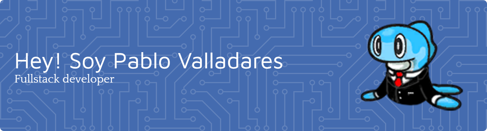

-   🌍  Vivo en El Puerto de Santa Maria.
-   🧠  Actualmenete estoy trabajando en proyectos personales.
-   ✉️  Puedes contactarme aquí [PValladaresG@proton.me](mailto:PValladaresG@proton.me).
-   🌐  Puedes encontrar mi portfolio aquí [Portfolio](https://www.pablo-vg.com/es/).
-   📄  Aqui podras encontrar mi curriculum [CV](https://pvgceti.github.io/NotasYProyectos/Sobre-m%C3%AD).

### 💻 &nbsp;Software

### 🎨 &nbsp;Frontend

### 🔧 &nbsp;Backend

### 📹 Mis Videos de YouTube

    &nbsp;&nbsp;&nbsp;
    &nbsp;&nbsp;&nbsp;
    

